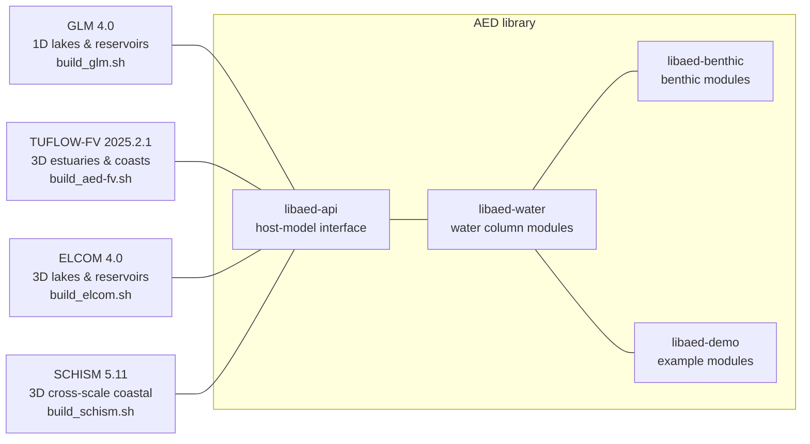

# AED_Tools

[](https://www.repostatus.org/#active)
[](https://github.com/AquaticEcoDynamics/libaed-water)
[](https://github.com/AquaticEcoDynamics/GLM)
[](https://www.tuflow.com/products/tuflow-fv/)
[](https://github.com/AquaticEcoDynamics/elcom-aed)
[](https://github.com/schism-dev/schism)
[](LICENSE)

**AED_Tools is the preferred starting point for developers working on AED model source code.**

Rather than containing the model source itself, this repository provides the scripts that
*fetch*, *build* and *manage* the AED source trees. You clone this repository, then use
`fetch_sources.sh` to pull down the model repositories you need alongside it, and the
`build_*.sh` scripts to compile them.

<br>

## Is this the repository you want?

`AED_Tools` builds the AED water quality library against four host models — **GLM**,
**TUFLOW-FV**, **ELCOM** and **SCHISM**. It is aimed at developers. If you simply want to *use*
one of these models, there is a better starting point:

| If you want to... | Go to |
|---|---|
| Download a ready-made executable | [`releases`](https://github.com/AquaticEcoDynamics/releases) |
| Build a stable, released version from source | the model's release bundle (below) |
| **Develop the models, or build from live source** | **this repository** |

### By model

| Model | Pre-compiled binaries | Stable source bundle | Build script here |
|---|---|---|---|
| **GLM** | [`releases/GLM-AED`](https://github.com/AquaticEcoDynamics/releases) | [`glm-aed`](https://github.com/AquaticEcoDynamics/glm-aed) | [`build_glm.sh`](build_glm.sh) |
| **TUFLOW-FV** | [`releases/FV-AED`](https://github.com/AquaticEcoDynamics/releases) | [`fv-aed`](https://github.com/AquaticEcoDynamics/fv-aed) | [`build_aed-fv.sh`](build_aed-fv.sh) |
| **ELCOM** | [`releases/ELCOM-AED`](https://github.com/AquaticEcoDynamics/releases) | [`elcom-aed`](https://github.com/AquaticEcoDynamics/elcom-aed) | [`build_elcom.sh`](build_elcom.sh) |
| **SCHISM** | [`releases/SCHISM-AED`](https://github.com/AquaticEcoDynamics/releases) | — | [`build_schism.sh`](build_schism.sh) |

For TUFLOW-FV, `build_aed-fv.sh` builds `libaed-fv` — the AED library that TUFLOW-FV links
against — rather than the TUFLOW-FV hydrodynamic engine itself, which is distributed separately.

The [`releases`](https://github.com/AquaticEcoDynamics/releases) repository is the archive of
current and historical pre-compiled executables across platforms — start there if you just need
to run a model.

The release bundles carry the model and the AED libraries as sub-modules pinned to fixed
commits, giving a reproducible build of a released version. `AED_Tools` instead tracks the
source repositories directly, so you work against live development branches. If you are not
developing the models, use the bundle.

SCHISM has no AED release bundle: its source is fetched from the upstream
[schism-dev](https://github.com/schism-dev/schism) project, with the AED coupling supplied from
the `schism-aed` directory of this repository. `fetch_sources.sh schism` does both steps for
you.

Note that the ELCOM source and its release bundle are private repositories — access is
restricted to the AED group and collaborators.

**`AED_Tools_Private`** is the equivalent tools repository for AED internal use. It
additionally supports the "plus" versions of our software and has limited support for building
TuflowFV. Access is restricted to the AED group.

<br>

## What AED_Tools builds

AED does not compute hydrodynamics itself — it links to a host hydrodynamic model through a
defined interface, so the same water quality configuration can be moved between host models.
The diagram below shows the libraries this repository fetches and builds, and the build script
for each host model.



The build scripts are also linked from the [table above](#by-model), since GitHub may not
render the diagram's links as clickable.

<br>

## Getting AED+

This repository builds the open AED library only. The **AED+** modules — `libaed-dev`
(modules in development), `libaed-riparian` (riparian modules) and `libaed-light` — are held in
private repositories and are **not available through `AED_Tools`**.

`fetch_sources.sh plus` and the `--with-aed-plus` build flag exist here, but both require access
to those private repositories; without it, the fetch will fail.

To work with AED+ you need:

1. membership of the AED group, or a collaboration agreement giving access to the private
   repositories, and
2. the [`AED_Tools_Private`](https://github.com/AquaticEcoDynamics/AED_Tools_Private) tools
   repository, which fetches and builds the AED+ sources by default.

If you are a researcher or practitioner who needs the AED+ modules, contact the AED group via
[aquatic.science.uwa.edu.au](https://aquatic.science.uwa.edu.au) to discuss access.

<br>

## Prerequisites

You will need:

- a Fortran compiler — `gfortran` is the default; `ifort`, `ifx`, `flang` and `clang` are also supported,
- **NetCDF** (C, and Fortran where required),
- **libgd** for builds with plotting support,
- **OpenMPI** for models that require it (e.g. SCHISM),
- `git`, `make` (`gmake` on FreeBSD), and a standard build toolchain.

If these are missing, the build scripts can compile them for you into the `ancillary`
directory — see [Building prerequisites](#building-prerequisites) below.

> [!IMPORTANT]
> `fetch_sources.sh` derives the git host from this repository's own `.git/config`, so it
> fetches the model repositories over whatever transport you used to clone `AED_Tools`. The
> private repositories (including the "plus" sources) require credentials — set up an SSH key
> on your GitHub account, or clone over HTTPS with a credential helper configured.
>
> `admin/change-git-https-to-ssh.sh` converts existing checkouts from HTTPS to SSH remotes.

<br>

## Getting started

### 1. Clone this repository

```
git clone https://github.com/AquaticEcoDynamics/AED_Tools.git
cd AED_Tools
```

### 2. Fetch the source trees

The source repositories are cloned *as siblings inside* this directory:

```
./fetch_sources.sh glm
```

This fetches GLM together with its dependencies (`libaed-api`, `libaed-water`,
`libaed-benthic`, `libaed-demo`, `libplot`, `libutil`).

Run with no arguments to **update** everything already present:

```
./fetch_sources.sh
```

Available targets:

| Target | Fetches |
|---|---|
| `glm` | GLM and its dependencies |
| `elcom` | ELCOM sources |
| `aed-fv` | `libaed-fv` sources |
| `libaed` | the `libaed-*` sources |
| `libplot` / `libutil` | supporting libraries |
| `plus` | the `libaed-*` "plus" sources (private repository) |
| `examples` | `GLM_Examples` |
| `schism` | SCHISM source, and links in the AED coupling |
| `swan` | SWAN, from TU Delft |
| `phreeqcrm` | PhreeqcRM, from USGS |
| `modflow` | MODFLOW 6 |
| `delft3d` | Delft3D 4 and Delft3D FM |
| `telemac` | TELEMAC-MASCARET |
| `all` | GLM, ELCOM, aed-fv and their requirements |

### 3. Build

Build scripts are run from this directory, not from inside the source tree:

```
./build_glm.sh
```

The resulting executable is placed in the relevant source directory.

<br>

## Build options

The build scripts share a common set of arguments:

| Option | Purpose |
|---|---|
| `--help` | List available options |
| `--auto-prereq` | Build missing prerequisites into `ancillary` |
| `--with-aed` / `--without-aed` | Build with or without the AED water quality libraries |
| `--with-aed-plus` / `--without-aed-plus` | Build with or without the AED "plus" modules |
| `--with-lib` / `--without-lib` | Build as a linked library |
| `--no-gui` | Build without plotting/display support |
| `--debug` | Build with debugging enabled |
| `--mdebug` | Build with mixing debug output |
| `--checks` | Enable runtime checks |
| `--fence` | Enable memory fencing |

A compiler is selected with one of `--gfort`, `--ifort`, `--ifx`, `--clang` or `--flang`.

Note that `build_glm.sh` enables the "plus" build automatically if a `libaed-dev` directory is
present.

Use `./clean.sh` to clean the source trees.

### Building prerequisites

`build_env.inc` works out which libraries each model needs and checks whether they are already
available. If they are not, passing `--auto-prereq` will build them into `ancillary`:

```
./build_glm.sh --auto-prereq
```

`ancillary/build.sh` can also be run directly, and `ancillary/msys_install` holds the scripts
for setting up a Windows/MSYS build environment.

<br>

## Setting up a build environment

The two routes below both target Ubuntu (tested against a vanilla Ubuntu 24 setup): a
**virtual machine**, or a **Docker container**. The package and build steps are identical; only
the way you get to a shell differs.

### Prerequisite packages (once per machine)

```
sudo apt install libnetcdf-dev libnetcdff-dev
sudo apt install libx11-dev libgd-dev
```

### Route A — Ubuntu virtual machine

1. Generate an SSH key and add it to your GitHub account — see
   [GitHub's instructions](https://docs.github.com/en/authentication/connecting-to-github-with-ssh/generating-a-new-ssh-key-and-adding-it-to-the-ssh-agent).
2. Set up the VM as a host in Visual Studio Code.
3. Connect to the VM over SSH from VS Code.
4. Install the prerequisite packages above.

### Route B — Docker container

1. Install Docker Desktop.
2. Build a container from a Dockerfile that installs the prerequisite packages above.
3. Configure your GitHub SSH key inside the container.
4. Open the container in VS Code as a dev container.

### Building

Once you have a shell with the prerequisites installed, the steps are the same either way:

```
git clone https://github.com/AquaticEcoDynamics/AED_Tools
cd AED_Tools/
./fetch_sources.sh all
./build_glm.sh
```

To then rebuild including the "plus" modules (requires access to the private repositories):

```
./clean.sh
./fetch_sources.sh plus
./build_glm.sh
```

`fetch_sources.sh plus` adds the "plus" sources alongside the existing checkouts, and
`build_glm.sh` picks them up automatically on the next build.

<br>

## Repository layout

| Path | Contents |
|---|---|
| `fetch_sources.sh` | Fetches and updates the model source trees |
| `build_*.sh` | Per-model build scripts |
| `build_env.inc`, `build_aedlibs.inc` | Shared build configuration and prerequisite detection |
| `clean.sh` | Cleans the source trees |
| `admin/` | Maintenance and release scripts (see below) |
| `ancillary/` | Sources and scripts for building prerequisite libraries |
| `third-party/` | Pinned commits for external models |
| `schism-aed/` | The AED coupling for SCHISM, and its patch |

<br>

## Working with third-party models

External models are not vendored. For each, `third-party/gitlog-<model>` records the exact
upstream commit to check out, and where AED modifications are required, an `xdiff` patch is
applied automatically after fetching. This keeps AED changes separate from upstream source
while pinning a known-good revision.

For SCHISM, `fetch_sources.sh` additionally symlinks `schism-aed/src/AED` into `schism/src/AED`.

<br>

## Admin scripts

The `admin` directory holds maintenance tooling:

| Script | Purpose |
|---|---|
| `status_check.sh` | Report the git status of every checked-out repository |
| `current_logs.sh` | Report the current commit of every repository |
| `make_diffs.sh` | Produce a diff file for each repository |
| `make_release_info.sh` | Generate the `ReleaseInfo.txt` recording build provenance |
| `glm_release_bundle.sh` | Bundle GLM with `libaed-*` as a release tarball |
| `libaed_release_bundle.sh`, `libfv_release_bundle.sh` | Equivalent bundles for the AED libraries |
| `make_tarballs.sh` | Build release tarballs |
| `extract-namelists.sh` | Extract namelist definitions from source |
| `change-git-https-to-ssh.sh` | Convert checkouts from HTTPS to SSH remotes |
| `tabclean.sh`, `clean_blanks.sh` | Source formatting helpers |

<br>

## Licence

See [LICENSE](LICENSE).
